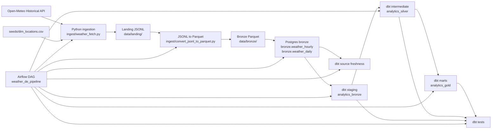

# Weather Data Pipeline with Open-Meteo Historical API

End-to-end batch pipeline for historical weather data using Python, Postgres, dbt, and Airflow.

## Project Evolution
This repository started as a local data engineering project built with Python, Postgres, dbt, and Airflow.

Current stable architecture (`v1-local-postgres`):
- raw weather responses stored in local files
- bronze data loaded into Postgres
- dbt models build staging, intermediate, and marts
- Airflow orchestrates the batch pipeline

Target migration (`v2-gcs-databricks`):
- raw weather responses stored in Google Cloud Storage (GCS)
- bronze tables stored in Databricks Delta tables
- dbt runs on Databricks for silver and gold layers
- orchestration moves toward Databricks Workflows

Why this migration:
- remove dependence on local disk for growing historical data
- align the project with modern lakehouse practices

Detailed planning docs:
- [V2 Architecture](docs/v2_architecture.md)
- [Migration Checklist](docs/migration_checklist.md)

## Stack

- Source: Open-Meteo Historical API
- Ingestion: Python
- Storage:
  - landing: JSONL
  - bronze: Parquet + Postgres
- Transformation: dbt
- Orchestration: Airflow

## Pipeline

1. Fetch hourly and daily historical weather for active locations from `seeds/dim_locations.csv`
2. Write raw API responses to `data/landing/`
3. Flatten JSONL into hourly and daily Parquet datasets under `data/bronze/`
4. Load Parquet into Postgres `bronze` schema with upsert logic
5. Build dbt models across staging, intermediate, and marts
6. Run freshness and data quality tests

## Architecture



## Data Model

Postgres objects created by the pipeline:

- Raw load layer
  - `bronze.weather_hourly`
  - `bronze.weather_daily`
- dbt staging
  - `analytics_bronze.stg_bronze__weather_hourly`
  - `analytics_bronze.stg_bronze__weather_daily`
- dbt intermediate
  - `analytics_silver.int_weather_hourly_enriched`
  - `analytics_silver.int_weather_daily_enriched`
- dbt marts
  - `analytics_gold.dim_locations`
  - `analytics_gold.fct_weather_daily_api`
  - `analytics_gold.fct_weather_daily_hourly`
  - `analytics_gold.fct_weather_daily`
  - `analytics_gold.fct_weather_daily_quality`

## Data Quality Controls

- Unique-key protection and upsert loading in bronze
- dbt not-null and uniqueness tests on core keys
- Metric range and domain checks
- Source freshness checks on bronze sources
- API daily vs hourly-derived reconciliation checks
- Quality mart:
  - `analytics_gold.fct_weather_daily_quality`
  - includes `completeness_score` and `reconciliation_status`

## Manual Run

Prerequisites:

- Python environment with project dependencies installed
- Local Postgres available through:
  - `POSTGRES_HOST`
  - `POSTGRES_PORT`
  - `POSTGRES_DB`
  - `POSTGRES_USER`
  - `POSTGRES_PASSWORD`
- dbt Core with `dbt-postgres`

Run the pipeline step by step:

```bash
python3 ingest/weather_fetch.py
python3 ingest/convert_jsonl_to_parquet.py
python3 ingest/postgres_loader.py --schema bronze --mode upsert
dbt deps
dbt seed --full-refresh
dbt source freshness
dbt run --exclude try
dbt test --exclude try
```

Optional fixed fetch window:

```bash
WEATHER_START_DATE=2024-02-01 WEATHER_END_DATE=2024-02-07 python3 ingest/weather_fetch.py
```

Default fetch behavior when dates are not provided:

- `WEATHER_LOOKBACK_DAYS=7`
- `end_date = today - 5 days`

## Airflow Run

Start local Airflow and Postgres:

```bash
make airflow-init
make airflow-up
```

Trigger the DAG:

```bash
make airflow-trigger
```

Airflow UI:

- URL: `http://localhost:8080`
- username: `admin`
- password: `admin`

DAG id:

- `weather_de_pipeline`

The DAG is manual-trigger only and runs this sequence:

- `fetch_open_meteo_data`
- `convert_jsonl_to_parquet`
- `load_bronze_to_postgres`
- `dbt_deps`
- `dbt_seed`
- `dbt_source_freshness`
- `dbt_run`
- `dbt_test`

Runtime parameters supported through `dag_run.conf`:

- `weather_start_date` (`YYYY-MM-DD`)
- `weather_end_date` (`YYYY-MM-DD`)
- `weather_lookback_days` (`integer`, default `90`)

Rules:

- if both `weather_start_date` and `weather_end_date` are passed, the DAG fetches that fixed range
- if neither is passed, the DAG uses `weather_lookback_days`
- if only one is passed, the run fails validation

Example trigger with a fixed window:

```bash
docker compose -f docker-compose.airflow.yml exec airflow-scheduler \
  airflow dags trigger weather_de_pipeline \
  --conf '{"weather_start_date":"2024-01-01","weather_end_date":"2024-01-07"}'
```

Stop services:

```bash
make airflow-down
```

## Notes

- `models/try.sql` (if exists) is as a playground for development, and is excluded from Airflow and manual dbt run/test commands
- `dim_locations.csv` is reseeded on each Airflow run, so the warehouse can be rebuilt from scratch
